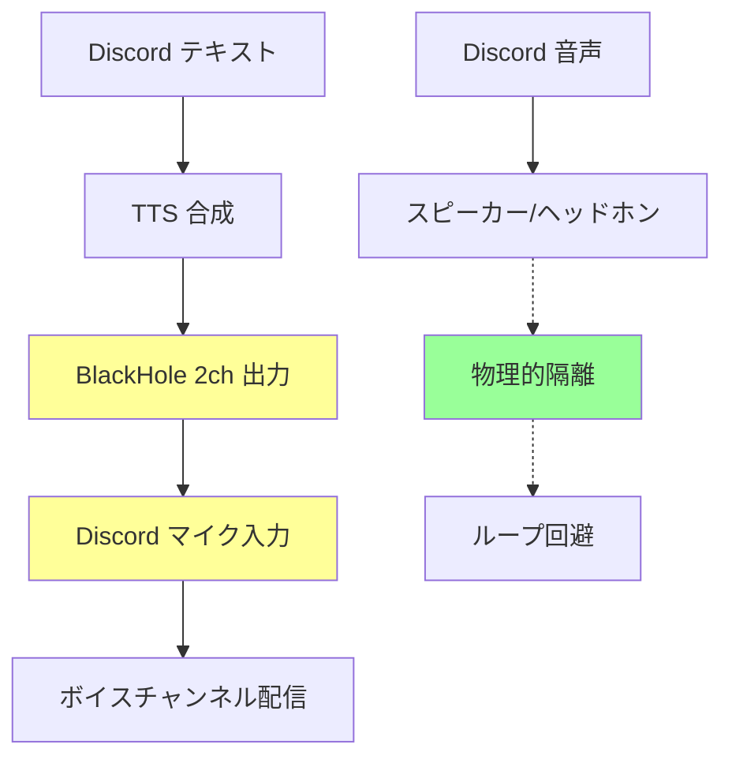

# Discord TTS Bridge

Discord テキストチャンネルのメッセージを **macOS TTS** または **VOICEVOX** で読み上げて、BlackHole 経由で Discord ボイスチャンネルに配信するアプリケーションです。

## 特徴

- 📡 **リアルタイム読み上げ**: Discord のテキストメッセージを即座に TTS で音声化
- 🎌 **日本語対応**: macOS の高品質な日本語音声（Kyoko, Otoya など）を使用
- 🔊 **BlackHole 連携**: 仮想オーディオドライバ経由で Discord に音声配信
- ⚙️ **高度な設定**: 音声、話速、音量など細かい調整が可能
- 🤖 **Bot 統合**: Discord.js v14 を使用した安定した Bot 接続
- 👥 **ユーザーフィルター**: 特定のユーザーのメッセージのみを読み上げ可能
- 🎭 **VOICEVOX対応**: ずんだもん、四国めたんなど高品質キャラクター音声

## 前提条件

### 必須ソフトウェア

- **Node.js 20 LTS** またはそれ以降
- **macOS Sonoma (14.0)** またはそれ以降
- **BlackHole 2ch** (仮想オーディオドライバ)
- **SwitchAudioSource** (音声出力切り替えツール)

### オプション（VOICEVOX使用時）

- **VOICEVOX** (高品質日本語音声合成エンジン)

### インストール

```bash
# BlackHole と SwitchAudioSource をインストール
brew install blackhole-2ch switchaudio-osx

# VOICEVOX（オプション）
# https://voicevox.hiroshiba.jp/ からダウンロード
```

### Discord Bot の準備

1. [Discord Developer Portal](https://discord.com/developers/applications) でアプリケーションを作成
2. Bot ページで Bot トークンを取得
3. 必要な権限を付与:
   - `Read Messages/View Channels`
   - `Read Message History`
   - `Use Slash Commands`
4. Bot をサーバーに招待

## セットアップ

### 1. プロジェクトのクローン

```bash
git clone <repository-url>
cd discord-tts-bridge
```

### 2. 依存関係のインストール

```bash
npm install
```

### 3. 環境変数の設定

```bash
cp env.example .env
```

`.env` ファイルを編集して Discord Bot のトークンとチャンネル ID を設定:

```env
BOT_TOKEN=your_discord_bot_token_here
CHANNEL_ID=your_text_channel_id_here
```

### 4. TypeScript のビルド

```bash
npm run build
```

## 使用方法

### 🔧 設定方法

このアプリケーションは **環境変数** または **CLI引数** で設定できます。環境変数を使用することで、毎回長いコマンドを入力する必要がありません。

#### 環境変数による設定（推奨）

```bash
# .envファイルを編集
cp env.example .env
```

`.env`ファイルで設定を行い、シンプルに実行:

```bash
# .envファイルの設定だけで実行
npm run dev

# または直接実行
npx tsx src/index.ts
```

#### CLI引数による設定

```bash
# CLI引数ですべてを指定
npx tsx src/index.ts \
  --token "YOUR_BOT_TOKEN" \
  --channel "TEXT_CHANNEL_ID" \
  --voice "Kyoko" \
  --rate 230
```

> **Note**: CLI引数は環境変数より優先されます。

### 基本的な実行（macOS TTS）

#### .envを使用（推奨）
```env
# .env
BOT_TOKEN=your_discord_bot_token_here
CHANNEL_ID=your_text_channel_id_here
TTS_ENGINE=macos
TTS_VOICE=Kyoko
TTS_RATE=230
BLACKHOLE_DEVICE=BlackHole 2ch
```

```bash
npm run dev
```

#### CLI引数を使用
```bash
npx tsx src/index.ts \
  --token "YOUR_BOT_TOKEN" \
  --channel "TEXT_CHANNEL_ID" \
  --voice "Kyoko" \
  --rate 230 \
  --blackhole "BlackHole 2ch"
```

### 🎭 VOICEVOX でずんだもんを使用

#### .envを使用（推奨）
```env
# .env
BOT_TOKEN=your_discord_bot_token_here
CHANNEL_ID=your_text_channel_id_here
TTS_ENGINE=voicevox
VOICEVOX_SPEAKER=3
```

```bash
# 1. VOICEVOXを起動
open -a VOICEVOX

# 2. アプリケーション起動
npm run dev
```

#### CLI引数を使用
```bash
# 1. VOICEVOXを起動
open -a VOICEVOX

# 2. ずんだもんで読み上げ
npx tsx src/index.ts \
  --token "YOUR_BOT_TOKEN" \
  --channel "TEXT_CHANNEL_ID" \
  --engine voicevox \
  --voicevox-speaker 3
```

### 🎌 人気キャラクターの使用例

```bash
# ずんだもん（ノーマル）
npx tsx src/index.ts --engine voicevox --voicevox-speaker 3

# ずんだもん（あまあま）
npx tsx src/index.ts --engine voicevox --voicevox-speaker 1

# 四国めたん（ノーマル）
npx tsx src/index.ts --engine voicevox --voicevox-speaker 2

# 春日部つむぎ
npx tsx src/index.ts --engine voicevox --voicevox-speaker 8
```

### 📋 キャラクタープリセット一覧

```bash
# 利用可能なキャラクター一覧を表示
npx tsx src/index.ts list-presets
```

出力例：
```
=== VOICEVOXキャラクタープリセット ===
zundamon           : ずんだもん (ノーマル) [ID: 3]
zundamon_amaama    : ずんだもん (あまあま) [ID: 1]
zundamon_tuntun    : ずんだもん (ツンツン) [ID: 5]
metan              : 四国めたん (ノーマル) [ID: 2]
metan_amaama       : 四国めたん (あまあま) [ID: 0]
tsumugi            : 春日部つむぎ (ノーマル) [ID: 8]
ryusei             : 青山龍星 (ノーマル) [ID: 13]
hau                : 波音リツ (ノーマル) [ID: 10]
```

### 特定ユーザーのみ読み上げ

#### .envを使用（推奨）
```env
# .env - 単一ユーザー
BOT_TOKEN=your_discord_bot_token_here
CHANNEL_ID=your_text_channel_id_here
ALLOWED_USERS=290338075920564224

# .env - 複数ユーザー（カンマ区切り）
ALLOWED_USERS=123456789012345678,987654321098765432,555666777888999000
```

```bash
npm run dev
```

#### CLI引数を使用
```bash
# 特定のユーザーID（単一）
npx tsx src/index.ts \
  --token "YOUR_BOT_TOKEN" \
  --channel "TEXT_CHANNEL_ID" \
  --allowed-users "123456789012345678,987654321098765432,555666777888999000"

# 複数のユーザーID（カンマ区切り）
npx tsx src/index.ts \
  --token "YOUR_BOT_TOKEN" \
  --channel "TEXT_CHANNEL_ID" \
  --allowed-users "123456789012345678,987654321098765432,555666777888999000"
```

### 音声を自分でも聞く設定

#### 方法1: マルチ出力デバイス使用（推奨）

```env
# .env
BOT_TOKEN=your_discord_bot_token_here
CHANNEL_ID=your_text_channel_id_here
BLACKHOLE_DEVICE=TTS Multi-Output
```

```bash
# マルチ出力デバイスを作成後
npm run dev
```

#### 方法2: デュアル出力機能使用

```env
# .env
BOT_TOKEN=your_discord_bot_token_here
CHANNEL_ID=your_text_channel_id_here
ENABLE_DUAL_OUTPUT=true
SPEAKER_DEVICE=外部ヘッドホン
```

```bash
npm run dev
```

#### CLI引数を使用
```bash
# アプリ側でBlackHoleとスピーカーの両方に再生
npx tsx src/index.ts \
  --token "YOUR_BOT_TOKEN" \
  --channel "TEXT_CHANNEL_ID" \
  --enable-dual-output \
  --speaker-device "外部ヘッドホン"

# 利用可能なデバイス名を確認
SwitchAudioSource -a -t output
```

### CLI オプション

#### 基本オプション

| オプション | 短縮形 | 環境変数 | デフォルト | 説明 |
|-----------|--------|----------|-----------|------|
| `--token` | `-t` | `BOT_TOKEN` | - | Discord Bot トークン |
| `--channel` | `-c` | `CHANNEL_ID` | - | 読み上げ対象のテキストチャンネル ID |
| `--voice` | `-v` | `TTS_VOICE` | `Kyoko` | macOS TTS 音声 |
| `--rate` | `-r` | `TTS_RATE` | `230` | 話速（文字/分） |
| `--volume` | | `TTS_VOLUME` | `50` | 音量（0-100） |
| `--blackhole` | `-b` | `BLACKHOLE_DEVICE` | `BlackHole 2ch` | BlackHole デバイス名 |
| `--afplay` | | `USE_AFPLAY` | `false` | afplay コマンドを使用 |
| `--allowed-users` | `-u` | `ALLOWED_USERS` | 全ユーザー | 読み上げを許可するユーザーID（カンマ区切り） |
| `--enable-dual-output` | | `ENABLE_DUAL_OUTPUT` | `false` | デュアル出力を有効にする |
| `--speaker-device` | | `SPEAKER_DEVICE` | なし | 追加で再生するスピーカーデバイス名 |

#### TTSエンジン選択

| オプション | 環境変数 | デフォルト | 説明 |
|-----------|----------|-----------|------|
| `--engine` | `TTS_ENGINE` | `macos` | TTSエンジン (`macos` / `voicevox`) |

#### VOICEVOXオプション

| オプション | 環境変数 | デフォルト | 説明 |
|-----------|----------|-----------|------|
| `--voicevox-host` | `VOICEVOX_HOST` | `localhost` | VOICEVOXサーバーホスト |
| `--voicevox-port` | `VOICEVOX_PORT` | `50021` | VOICEVOXサーバーポート |
| `--voicevox-speaker` | `VOICEVOX_SPEAKER` | `3` | スピーカーID（ずんだもん） |
| `--voicevox-speed` | `VOICEVOX_SPEED` | `1.0` | 話速倍率 |
| `--voicevox-pitch` | `VOICEVOX_PITCH` | `0.0` | ピッチ調整 |
| `--voicevox-intonation` | `VOICEVOX_INTONATION` | `1.0` | イントネーション倍率 |
| `--voicevox-volume` | `VOICEVOX_VOLUME` | `1.0` | 音量倍率 |

### ユーザーIDの取得方法

1. Discord の**開発者モード**を有効にする
   - 設定 → 詳細設定 → 開発者モード をオン
2. ユーザーを右クリック → **IDをコピー**

### 音声一覧の確認

#### macOS TTS
```bash
say -v "?"
```

#### VOICEVOX
```bash
npx tsx src/index.ts list-presets
```

日本語音声例: `Kyoko`, `Otoya`, `O-ren`

## Discord での設定

### 1. ボイスチャンネル参加
1. Discord デスクトップアプリを開く
2. ボイスチャンネルに参加
3. 左下の設定（歯車）アイコンをクリック

### 2. 音声設定
1. **音声・ビデオ** タブを選択
2. **マイク** を `BlackHole 2ch` または `TTS Multi-Output` に設定
3. **出力** は通常のスピーカー/ヘッドホンのまま

## 🔊 音声を自分でも聞く設定

### マルチ出力デバイスの作成

読み上げ音声を自分でも聞きたい場合は、**マルチ出力デバイス**を作成します。

#### 手順

1. **Audio MIDI Setup を開く**
   ```bash
   open "/Applications/Utilities/Audio MIDI Setup.app"
   ```

2. **マルチ出力デバイスを作成**
   - 左下の `+` ボタン → `マルチ出力デバイスを作成`
   - 新しく作成されたデバイス名を `TTS Multi-Output` に変更

3. **出力先を設定**
   - ✅ `BlackHole 2ch` にチェック
   - ✅ 使用中のスピーカー/ヘッドホン（例: `外部ヘッドホン`）にチェック
   - `BlackHole 2ch` の **マスターデバイス** にチェック

4. **アプリでマルチ出力デバイスを使用**
   ```bash
   npx tsx src/index.ts \
     --token "YOUR_BOT_TOKEN" \
     --channel "CHANNEL_ID" \
     --allowed-users "USER_ID" \
     --blackhole "TTS Multi-Output"
   ```

#### 設定例画面

```
Audio MIDI Setup
├── TTS Multi-Output (作成したデバイス)
    ├── ✅ BlackHole 2ch        [マスター]
    ├── ✅ 外部ヘッドホン       [ ]
    └── ドリフト補正: オン
```

### Discord での設定変更

マルチ出力デバイス使用時のDiscord設定：

1. **マイク**: `BlackHole 2ch` （変更なし）
2. **出力**: 通常のスピーカー/ヘッドホン （変更なし）

> **重要**: マルチ出力デバイスは BlackHole と物理デバイスの両方に音声を送るため、Discord のマイク設定は引き続き `BlackHole 2ch` を使用します。

### トラブルシューティング

#### 音声が重複して聞こえる
- Discord の出力音量を下げる
- または Discord の出力を別のデバイスに変更

#### マルチ出力デバイスが見つからない
```bash
# 利用可能なデバイスを確認
SwitchAudioSource -a -t output | grep -i multi
```

#### 音声遅延が発生する
- Audio MIDI Setup で「ドリフト補正」を有効にする
- サンプルレートを統一する（通常は 44.1 kHz）

## 音響ループ回避の仕組み



### ループ回避のポイント

1. **入力**: BlackHole 2ch (アプリからの音声)
2. **出力**: 物理スピーカー/ヘッドホン (Discord からの音声)
3. **分離**: 仮想と物理デバイスの完全分離

## 使用例

### 配信者向け設定

#### .envを使用（推奨）
```env
# .env
BOT_TOKEN=your_discord_bot_token_here
CHANNEL_ID=your_chat_channel_id_here
ALLOWED_USERS=your_user_id_here
TTS_VOICE=Kyoko
TTS_RATE=200
```

```bash
npm run dev
```

#### CLI引数を使用
```bash
# 配信者自身のメッセージのみ読み上げ
npx tsx src/index.ts \
  --token "YOUR_BOT_TOKEN" \
  --channel "CHAT_CHANNEL_ID" \
  --allowed-users "YOUR_USER_ID" \
  --voice "Kyoko" \
  --rate 200
```

### モデレーター限定

#### .envを使用（推奨）
```env
# .env
BOT_TOKEN=your_discord_bot_token_here
CHANNEL_ID=your_mod_channel_id_here
ALLOWED_USERS=mod1_id,mod2_id,mod3_id
TTS_VOICE=Otoya
```

```bash
npm run dev
```

#### CLI引数を使用
```bash
# 複数のモデレーターのみ
npx tsx src/index.ts \
  --token "YOUR_BOT_TOKEN" \
  --channel "MOD_CHANNEL_ID" \
  --allowed-users "MOD1_ID,MOD2_ID,MOD3_ID" \
  --voice "Otoya"
```

### 高品質VOICEVOX設定例

#### ずんだもん（あまあま）+ 高音質設定
```env
# .env
BOT_TOKEN=your_discord_bot_token_here
CHANNEL_ID=your_text_channel_id_here
TTS_ENGINE=voicevox
VOICEVOX_SPEAKER=1
VOICEVOX_SPEED=0.9
VOICEVOX_PITCH=0.1
VOICEVOX_INTONATION=1.2
VOICEVOX_VOLUME=0.8
```

#### 四国めたん + カスタム設定
```env
# .env
BOT_TOKEN=your_discord_bot_token_here
CHANNEL_ID=your_text_channel_id_here
TTS_ENGINE=voicevox
VOICEVOX_SPEAKER=2
VOICEVOX_SPEED=1.1
VOICEVOX_PITCH=-0.05
VOICEVOX_INTONATION=0.9
```

## トラブルシューティング

### BlackHole が認識されない

```bash
# 利用可能な出力デバイスを確認
SwitchAudioSource -a -t output

# BlackHole を手動でインストール
brew reinstall blackhole-2ch
```

### TTS 音声が見つからない

```bash
# 利用可能な音声を確認
say -v "?"

# システム音声設定を確認
open /System/Library/PreferencePanes/Speech.prefPane
```

### Discord Bot が接続できない

1. Bot トークンの確認
2. Bot 権限の確認（`Message Content Intent` が必要）
3. チャンネル ID の確認（右クリック → ID をコピー）

### ユーザーフィルターが動作しない

1. ユーザーIDが正しいかの確認
2. 開発者モードが有効になっているかの確認
3. ログでユーザーIDが表示されるかの確認

### 音声が出力されない

1. macOS の音量設定を確認
2. BlackHole デバイスの設定を確認
3. Discord のマイク設定を確認

## 開発

### 開発モード

```bash
npm run dev
```

### リント・フォーマット

```bash
npm run lint        # ESLint チェック
npm run lint:fix    # ESLint 自動修正
npm run format      # Prettier フォーマット
```

### ビルド

```bash
npm run build       # TypeScript コンパイル
npm start           # ビルド済みファイルの実行
```

## アーキテクチャ

```
src/
├── index.ts       # エントリポイント・CLI 解析
├── discord.ts     # Discord 接続・イベント処理
├── tts.ts         # macOS TTS ラッパー
├── audio.ts       # 音声再生・デバイス切り替え
└── utils.ts       # 共通ユーティリティ
```

## ライセンス

MIT License

## 貢献

Issues と Pull Requests を歓迎します。

## 参考資料

- [Discord.js ドキュメント](https://discord.js.org/)
- [BlackHole オフィシャル](https://github.com/ExistentialAudio/BlackHole)
- [macOS say コマンド](https://ss64.com/osx/say.html) 